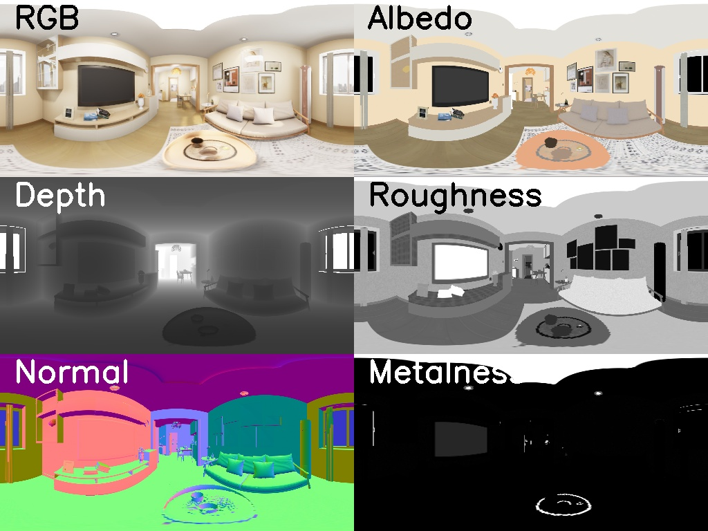
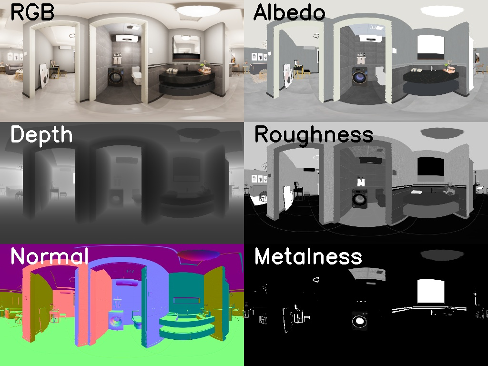

# FutureHouse

|                         场景1                          |                         场景2                         |
| :----------------------------------------------------: | :---------------------------------------------------: |
|  |  |

#### 1. Introduction

This the webpage of our dataset named *FutureHouse* which is proposed in the paper, "PhyIR: Physics-based Inverse Rendering for Panoramic Indoor Images" ([Project page](http://yodlee.top/PhyIR/)). 

#### 2. News

+ 2022.08.19: release illumination data (KePanoLight V1). We had sent the download link of this data to researchers who have requested the dataset. Illumination V1 lacks the light probes of top and down faces. We will release the V2 once the rest data is done.
+ 2022.08.04: release the official interface code of dataset and the official split.

#### 3. Download

Please send an email to yodlee@mail.nwpu.edu.cn with some necessary information and we will send a download link to you. 

Note that the size of illumination data is large and we have not finished the processing of illumination data. So we will provide all labels except for illumination first and will send you the download link of illumination once  it is released.

```
# the necessary information of the request email
name: xx
organization: xx
email for receiving link: xx
```

#### 4. Usage

We encourage researchers to use the files we provide to split the dataset and access the dataset.

The split file can be found in [split.json](./split.json).

The `Pytorch Dataset Class` can be found in [Dataset.py](./DataSet.py).

#### 5. Citation

```
@inproceedings{li2022phyir,
    title={PhyIR: Physics-based Inverse Rendering for Panoramic Indoor Images},
    author={Li, Zhen and Wang, Lingli and Huang, Xiang and Pan, Cihui and Yang, Jiaqi.},
    booktitle = {Proc. IEEE Conf. on Computer Vision and Pattern Recognition (CVPR)}, 
    year={2022}
}
```


